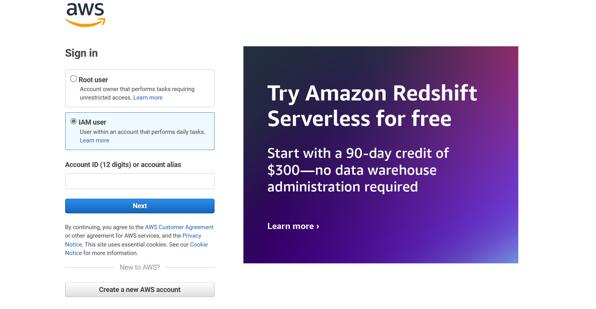
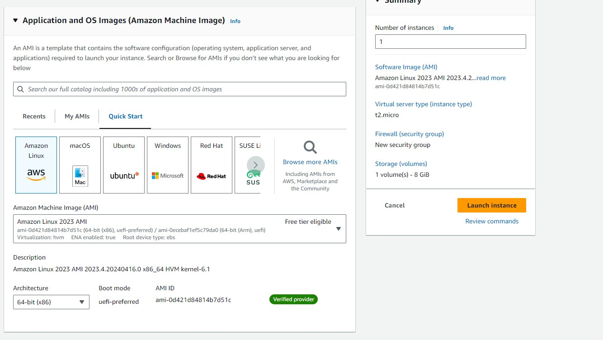
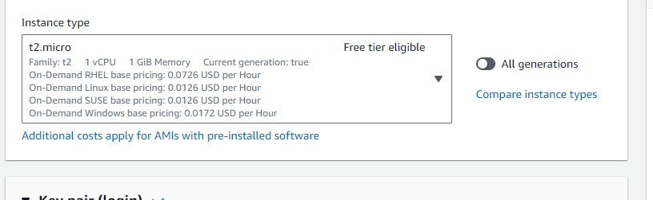
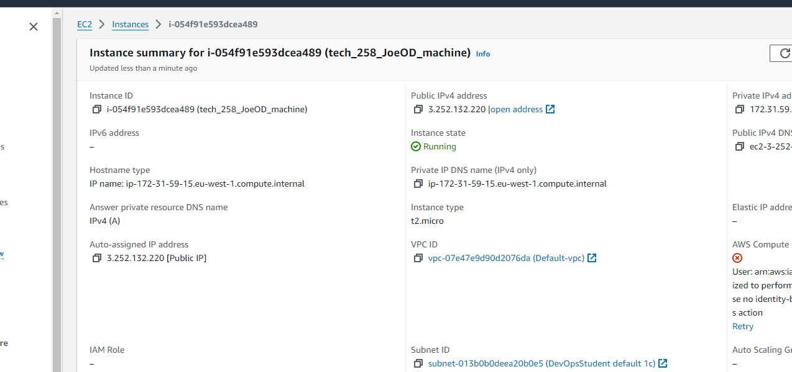
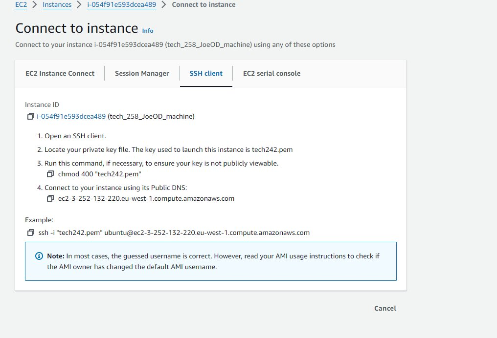

# A step by step guide to deploying a virtual machine  on AWS using the gui console


Amazon Web Services (AWS) is a leading cloud computing platform that offers a wide range of services to help businesses and individuals build and manage their IT infrastructure in the cloud. From virtual servers and storage solutions to databases, machine learning, and more, AWS provides scalable and flexible resources that enable organizations to innovate, reduce costs, and scale their applications with ease.

We are going to show you step by step how to deploying a virtual machine (ec2-instance) on AWS using the gui console and how to deploy nginx on it :

### Step 1 - Sign in to the AWS Management Console: 

* Sign in to the AWS Management Console: Go to the AWS Management Console at https://aws.amazon.com/console/ and sign in to your AWS account.
<br>



### Step 2 - Navigate to EC2 Dashboard: 

* Once logged in, navigate to the EC2 service by either searching for EC2 in the services search bar or by clicking on the "Services" dropdown menu at the top left corner and selecting EC2 under the "Compute" section.
<br>


### Step 3 - Launch Instance

+ Launch Instance: On the EC2 Dashboard, click on the "Launch Instance" button to start the process of creating a new virtual machine.


### Step 4 - Name and choose an Amazon Machine Image (AMI): 

* In the name and tags section give your virtual machine a name. Then In the Choose an Amazon Machine Image (AMI)" section, select the AMI that corresponds to the operating system and software configuration you want for your virtual machine. AWS provides a variety of pre-configured AMIs for different purposes, such as Amazon Linux, Ubuntu, Windows Server, etc. 
 In our case we are going to choose amazon Linux free tier option
<br> 


* *Machine images, often referred to as Amazon Machine Images (AMIs) in the context of AWS, are pre-configured templates that contain the necessary information to launch virtual servers, known as instances, in the cloud.*



### Step 5 - Choose an instance type 

* Choose an Instance Type" section, select the instance type that suits your workload requirements. Instance types vary in terms of CPU, memory, storage, and networking capacity. In our case we will choose "t2.micro" 



### Step 6 - Add Key pair login 

* When launching an instance on AWS, particularly with Amazon EC2, you're given the option to specify a key pair. This key pair consists of a public key that AWS stores, and a private key that you download. This key pair is crucial for securely connecting to your instance over SSH (for Linux instances) or RDP (for Windows instances). it is crucial that you do not share this key and keep it inside your ssh.folder

* At the moment pick the tech258 one.

### Step 7 Configure network settings 

I will explain the network settings as follows : 

 * What are security groups?
     * Security Groups in AWS are virtual firewalls that control inbound and outbound traffic.
   * What are ports?
     * Ports are communication endpoints that allow different services or applications to connect and exchange data over a network.
     * Each port number corresponds to a specific service or protocol, allowing for efficient and secure data transfer over networks. SSH uses port 22, and HTTP uses port 80. If you were using HTTPS it would be port 433.

 


* After this click Launch Instance!

### Step 8 - Check to see your virtual machine has deployed 

* One loaded click on the instances tab to check that your VM is running. 




### Step 9 - Deploying nginx on your EC2 instance

* Open an SSH client- in our case we will use Gitbash and type in your ssh client 





Well done you have launched your e2 client!


******************************************

# Deploying nginx on your E2 instance 

Now you are logged into your virtual machine this is how you deploy nginx on your E2 instance.

This is what your screen should look like now 


### Step 1  - Enter the following commands to update and install 

* Enter the following commands to  install and update their necessary ubuntu packages.

```python
sudo apt update -y
sudo apt upgrade -y
```


### Step 11 - Install nginx 

* Install nginx with this command on Gitbash : 

````python 
sudo apt  install nginx -y
````

* *Nginx (pronounced "engine-x") is a popular open-source web server, reverse proxy server, and load balancer. It's known for its high performance, stability, and scalability, making it widely used for serving web content, hosting websites, and balancing traffic across multiple servers.*

## Step 12 - Well done!

* You should see a active running comment in your terminal that shows it is running. 
If you put your EX2 public IP address into the URL of your web browser, you can see your vm being hosted 


# How to deploy your application

# Step 1 : Access the Instance

* Log in to the instance where you want to copy the app. This could be via SSH or any other method based on your setup.

# Step 2 : Prepare the Instance

* Log in to the instance where you want to copy the app. This could be via SSH or any other method based on your setup.

# Step 3 : Transfer the App

* Use a secure file transfer method like SCP or SFTP to transfer the app files from your local machine to the instance. Here's an example using SCP:
```python
scp -r /path/to/your/app username@instance_ip:/path/on/instance
```
# Step 4 : Wait for it to download 

* wait for the files to transfer and download.

# Step 5 : Install node 

* Install node.js 

```curl -fsSL https://deb.nodesource.com/setup_20.x | sudo -E bash - &&\
sudo apt-get install -y nodejs
```

* Check node version 

```python
node -v
```

### What is node? 

Node.js is a runtime environment that enables running JavaScript code outside of web browsers, leveraging Chrome's V8 JavaScript engine. It's favored for its event-driven, non-blocking I/O model, making it efficient for scalable network applications like server-side programs, APIs, and real-time systems such as chat applications. Central to its appeal is npm, the Node Package Manager, offering a vast array of open-source libraries for developers to utilize. With its asynchronous architecture, Node.js executes operations concurrently, allowing it to handle numerous connections effectively, making it a top choice for high-performance applications.

# Step 6 : Type commands npm install and start  

* Type in the commands npm install and npm start 

```python
npm install 
```
```python
npm start 
```
# Step 7 : get the app folder

* This command clones a repository from the specified URL, in this case, it's cloning a repository named "Sparta_test_app2" from GitHub.
```
git clone https://github.com/joeodx/Sparta_test_app2.git
```
# Step 8 : cd app folder
*  This command changes the current directory to the "app" directory within the cloned repository.
```
~/Sparta_test_app2/app
```

# Step 9 : Install app
* This command installs all the dependencies required for the application to run. It reads the "package.json" file in the current directory and installs all dependencies listed in it.
```
npm install 
```

# Step 10 : To stop processes 

This command stops the application named "app" using PM2, a process manager for Node.js applications. The sudo command is used to ensure proper permissions for stopping the process.
```
sudo pm2 stop app
```

# Step 11 :Run app
This command starts the Node.js application named "app.js" using PM2. It manages the application process in the background, ensuring it stays running even if the terminal session is closed.
```
pm2 start app.js app
```


