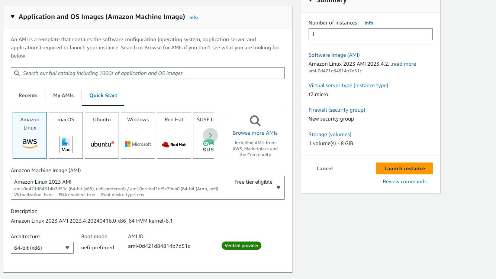
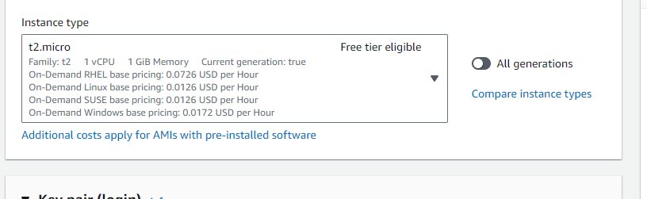
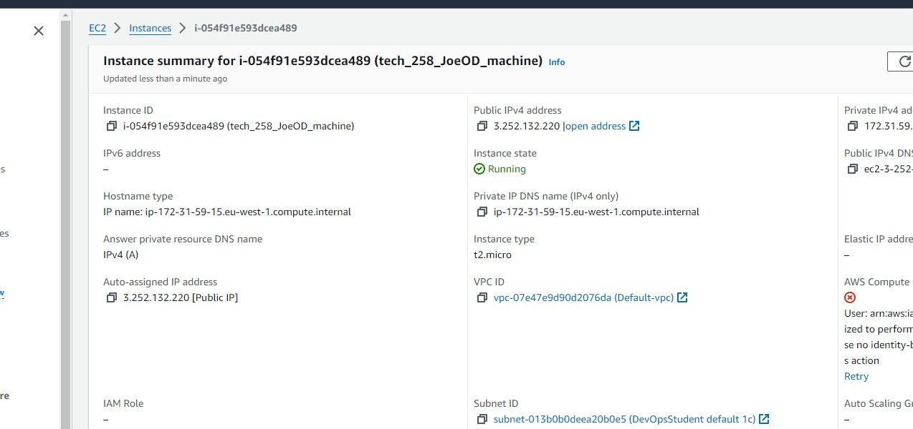

# A step by step guide to deploying a virtual machine  on AWS using the gui console


Amazon Web Services (AWS) is a leading cloud computing platform that offers a wide range of services to help businesses and individuals build and manage their IT infrastructure in the cloud. From virtual servers and storage solutions to databases, machine learning, and more, AWS provides scalable and flexible resources that enable organizations to innovate, reduce costs, and scale their applications with ease.

We are going to show you step by step how to deploying a virtual machine (ec2-instance) on AWS using the gui console and how to deploy nginx on it :

### Step 1 - Sign in to the AWS Management Console: 

* Sign in to the AWS Management Console: Go to the AWS Management Console at https://aws.amazon.com/console/ and sign in to your AWS account.
<br>


### Step 2 - Navigate to EC2 Dashboard: 

* Once logged in, navigate to the EC2 service by either searching for EC2 in the services search bar or by clicking on the "Services" dropdown menu at the top left corner and selecting EC2 under the "Compute" section.
<br>


### Step 3 - Launch Instance

+ Launch Instance: On the EC2 Dashboard, click on the "Launch Instance" button to start the process of creating a new virtual machine.


### Step 4 - Name and choose an Amazon Machine Image (AMI): 

* In the name and tags section give your virtual machine a name. Then In the Choose an Amazon Machine Image (AMI)" section, select the AMI that corresponds to the operating system and software configuration you want for your virtual machine. AWS provides a variety of pre-configured AMIs for different purposes, such as Amazon Linux, Ubuntu, Windows Server, etc. 
 In our case we are going to choose amazon Linux free tier option
<br> 


* *Machine images, often referred to as Amazon Machine Images (AMIs) in the context of AWS, are pre-configured templates that contain the necessary information to launch virtual servers, known as instances, in the cloud.*



### Step 5 - Choose an instance type 

* Choose an Instance Type" section, select the instance type that suits your workload requirements. Instance types vary in terms of CPU, memory, storage, and networking capacity. In our case we will choose "t2.micro" 



### Step 6 - Add Key pair login 

* When launching an instance on AWS, particularly with Amazon EC2, you're given the option to specify a key pair. This key pair consists of a public key that AWS stores, and a private key that you download. This key pair is crucial for securely connecting to your instance over SSH (for Linux instances) or RDP (for Windows instances). it is crucial that you do not share this key and keep it inside your ssh.folder


* * Here's how it works:
 Public Key: AWS stores the public key of the key pair you select when launching the instance. This key is stored securely and associated with the instance.
 Private Key: You, as the user, download the private key to your local machine during the instance launch process. This private key should be kept secure and not shared with anyone. It's used to decrypt information encrypted with the associated public key. *


### Step 7 Configure network settings 

I will explain the network settings as follows : 

* **VPC (Virtual Private Cloud)** :
We are using the  default VPC, so there's no need to make any changes here. The default VPC is automatically created for your AWS account in each AWS Region.
* **Subnet** :
Since you have no preference for the subnet and you want AWS to automatically select a subnet in any availability zone, you can leave this setting as is. AWS will choose a default subnet for you.
* **Auto-assign Public IP** :
Enable this option if you want your instance to have a public IP address assigned automatically. This is necessary if you want your instance to communicate with the internet. Since you've enabled it, AWS will assign a public IP to your instance.
* **Firewall (Security Groups)** :
You're given the option to either create a new security group or select an existing one. Since you're creating a new instance, let's proceed with creating a new security group called 'launch-wizard-42'.
You'll see that AWS has pre-filled some default rules for the security group:
* **Allow SSH traffic**  from anywhere** : This allows you to connect to your instance using SSH. It's recommended to restrict this to your specific IP address or range for enhanced security.
** *Allow HTTPS traffic from the internet* : This allows incoming HTTPS traffic to your instance, typically used for web servers.
* **Allow HTTP traffic from the internet**: This allows incoming HTTP traffic to your instance, also typically used for web servers.
You can leave these default rules as they are if they meet your requirements.
* **However** , it's essential to follow the best practice of restricting access to your instance by specifying specific IP addresses or ranges whenever possible.

To summarize, you don't need to make any changes to the VPC or subnet settings since you're using the default options. Ensure that you've enabled auto-assign public IP if you want your instance to have internet access. For the security group, you can proceed with creating the new security group 'launch-wizard-42' with the pre-filled default rules, but consider modifying the SSH rule to restrict access to your specific IP address or range for improved security.

<br>


* After this click Launch Instance!

### Step 8 - check to see your virtual machine has deployed 

* One loaded click on the instances tab to check that your VM is running. 



### Step 9 - Connect to instance 

* Click the connect button and you should be presented with a page that says connect to instance : 


"Connect to instance" on AWS refers to the process of establishing a remote connection to a virtual server (instance) that you have launched within your AWS account. This connection allows you to interact with the instance's operating system, manage files, install software, and perform other administrative tasks.

We are going to do that as follows : 

### Step 9 - Deploying nginx on your EC2 instance

* Open an SSH client- in our case we will use Gitbash

* Follow the instructions on this page


### Step 10 - Enter the following commands to update and install 

* Enter the following commands to  install and update their necessary ubuntu packages.

```python
sudo apt update -y
sudo apt upgrade -y
```


### Step 11 - Install nginx 

* Install nginx with this command on Gitbash : 

````python 
sudo apt  install nginx -y
````


